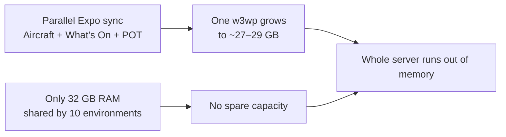

# FIA Website Memory Crash

Date of incident: 10 July 2026 (around 5:34 PM UK / 16:34 UTC)  
Server: WEB3-ADS  
Site / app pool: farnboroughairshow.com (FIA website)

---

## What happened

The FIA website process (`w3wp.exe`) grew to about **27–29 GB** of memory. Windows ran out of virtual memory, the process crashed, and the site could not restart cleanly until around **18:43 UK**.

SQL Server was not the cause. It was only using about **2.4 GB**. The website process was the one that ran away with memory.

### Event log (UK time) — confirmed from WEB3-ADS

| UK time | Event | Meaning |
| ----- | ----- | ----- |
| 17:34:22 | Out of Virtual Memory | Server ran out of virtual memory |
| 17:34:23 | Resource-Exhaustion Event ID 2004 | Top user: w3wp.exe (PID 13248) ≈ 27.2 GB; sqlservr.exe ≈ 2.4 GB |
| 17:34:46 | WAS Event ID 5011 | App pool farnboroughairshow.com failed — same PID 13248 |
| 17:34:48 | IIS AspNetCore 1007 / 1035 | Site failed to restart (not enough memory for CoreCLR) |
| 18:12 | WAS Event ID 5078 | App pool recycled again (reported unhealthy) |
| 18:43 | IIS AspNetCore 1032 | FIA app started successfully again |

All times in this document are London (UK) time.

---

## Exact issue

### 1. Code (main cause)

The website syncs data to **Expo** (an external system) for:

- Aircraft  
- What’s On  
- POT What’s On  

**Before the fix**, each of these had its own ~15-minute timer. They did not wait for each other. So all three could run at the same time.

What’s On and POT What’s On share the same template/code, but they are different pages — so before the fix they still had separate timers. Aircraft is a separate sync path.

**Exhibitors** already used a controlled background service and were much safer. Aircraft / What’s On / POT did not work that way until the fix.

#### Why memory can reach ~27–29 GB

This is not a sudden “mystery jump.” The pattern is:

1. Each sync job loads a **full list** into memory first (aircraft list, What’s On list, POT list), then sends items one by one.  
2. Before the fix, those jobs were **not capped** against each other — so two or three full lists could sit in the same `w3wp` process at once.  
3. With large listing data, that adds up inside one process. Windows Event Log then shows that same process at ≈ **27.2 GB** (PID 13248).

What we can say clearly:

- **Confirmed:** the FIA website process used ~27–29 GB and crashed the server.  
- **Confirmed by code:** parallel Expo sync was possible before the fix.  
- **Best explanation (medium-high):** that parallel design is why memory could grow that far. We do **not** have a measured “each job = X GB” breakdown from the crash window itself.

### 2. Server sizing (made the outage worse)

| Item | Value |
| ----- | ----- |
| Installed RAM | 32 GB |
| Environments on this server | 5 Production + 5 Staging (10 sites sharing the same RAM) |
| FIA w3wp at crash | ~27–29 GB |
| Disk C: | ~17.6 GB free of ~59 GB (tight, but not the main crash cause) |

One site took almost all the RAM. The other nine environments, SQL, and Windows had almost nothing left. That is why the whole server failed so hard.

32 GB is not enough for 10 environments on one box. CPU is fine. Disk C: should ideally stay above ~25 GB free, but RAM is the weak point.

Important: more RAM gives headroom and makes an outage less likely to hit so fast. It does **not** isolate sites from each other while they still share one machine. The lasting fix is still the code change (one sync at a time) plus an IIS memory limit. Extra RAM is support, not a full replacement for the code fix.

---

## What we fixed in code

Already implemented:

1. **Global sync gate** — only one Expo sync (Aircraft / What’s On / POT / Exhibitors) can run at a time.  
2. **Hosted background service** — sync runs on a shared ~15-minute cycle (page-hit sync disabled in Production).  
3. **Finish-based interval** — next job waits until the previous one finishes, then applies the min interval (`Expo:ExhibitorSync:ListingSyncMinIntervalMinutes`, default 15).  
4. **HTTP dispose** on Aircraft and Event Expo POSTs so request/response memory is released.  
5. Delta / one-by-one sending kept as before.

After deploy, look for log lines: `[Expo Sync Gate] Begin / End / Begin denied`.

| Before | After |
| ----- | ----- |
| Aircraft + What’s On + POT could run together | Only one Expo sync at a time |
| Separate 15-minute timers per page | One shared hosted cycle + global gate |
| Memory could grow to tens of GB | Memory stays controlled |

**Timeout note:** the 15-minute setting is a **minimum wait after a job finishes**. It is not a max runtime timeout for a job that is already running. If one sync hangs and never finishes, it can hold the global gate and block the queue. A hard timeout / fail-safe for a stuck sync still needs to be confirmed and, if missing, added. Sync duration at full capacity also needs to be measured from logs (not recorded in this incident write-up).

---

## What still needs doing

1. **IIS app pool Private Memory Limit** (e.g. 2–4 GB) on farnboroughairshow.com — safety net so one bug cannot take ~29 GB again.  
2. **Increase RAM** (e.g. 32 GB → 64 GB+) — more headroom for 10 environments on one box. Helps under load; does not replace the code fix or site isolation.  
3. **Deploy** the build with the global gate.  
4. **Confirm / add sync timeout** so one stuck job cannot hold the whole queue forever.  
5. **Measure sync duration** at full capacity from logs.  
6. **Monitoring** — set up Grafana / Prometheus / Loki (light agent on WEB3-ADS; dashboards on a separate server) to alert on high w3wp memory, Event ID 2004, and app pool failures (WAS 5011 / 5078).  
7. **Customer-facing diagram** — use the flow above (or a polished version) after internal review.

Temporary option if needed before deploy: turn off Enable API / Enable Expo API on Aircraft, What’s On, and POT What’s On, or recycle the app pool if the site is unhealthy.

---

## Confidence

| Finding | Confidence | Notes |
| ----- | ----- | ----- |
| FIA w3wp exhausted memory (not SQL) | Confirmed | Event ID 2004 + WAS 5011: PID 13248 ≈ 27.2 GB; SQL ≈ 2.4 GB |
| Site could not restart after OOM | Confirmed | AspNetCore 1007/1035 at 17:34:48 UK; recovered ~18:43 |
| Code allowed parallel Aircraft + What’s On + POT before the fix | Confirmed | Code review — separate timers, no global lock |
| Parallel Expo sync was running at the exact crash moment | Medium-high | Best explanation from code and behaviour; Event Log proves who ran out of memory, not overlapping sync log lines in that window |

---

## Bottom line

- Not a SQL problem.  
- Website memory grew because Expo sync jobs for Aircraft, What’s On, and POT What’s On could run in parallel and each held a full list in memory.  
- 32 GB shared across 10 environments left no spare capacity, so one heavy process took the whole server down.  
- Code fix is in place (one sync at a time + hosted cycle).  
- Still do: deploy, set IIS memory limit, confirm sync timeout, measure sync duration, add RAM as headroom, and switch on monitoring.
